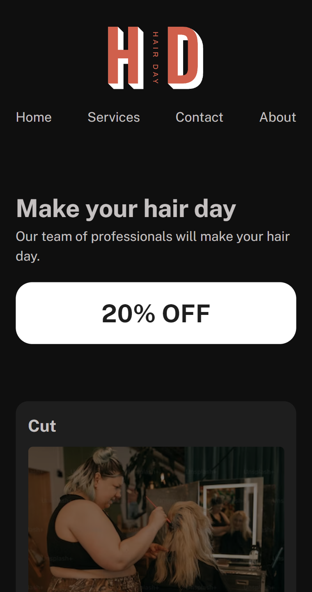
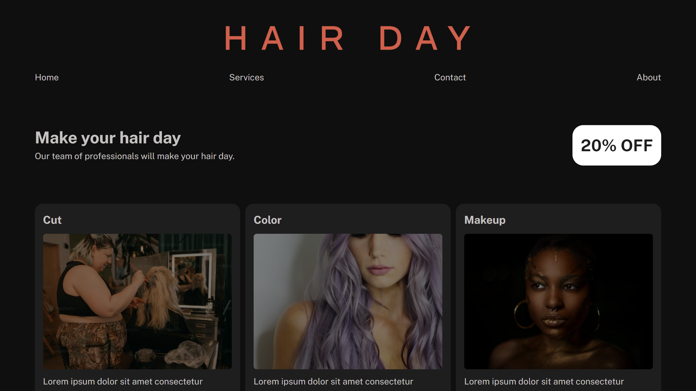

<h1 align="center"> Hair Day </h1>

Final project of the course <strong>[HTML and CSS in depth](https://www.coursera.org/learn/html-and-css-in-depth)</strong>, part of the training for the <strong>[Meta Front-End Developer Professional Certificate](https://www.coursera.org/professional-certificates/meta-front-end-developer).

<h2 id="live">👁️‍🗨️ Live</h2>

This project is hosted at Github Pages of this repository by the link <a href="https://leonardojacomussi.github.io/meta-hair-day/" target="_blank">https://leonardojacomussi.github.io/meta-hair-day/</a>

<table>
  <tbody>
    <tr>
      <td>
        
      </td>
      <td>
        
      </td>
    </tr>
  </tbody>
</table>

<h2 id="technologies">🚀 Technologies</h2>

This project was developed with the following technologies:

- HTML and CSS
- Git and Github
